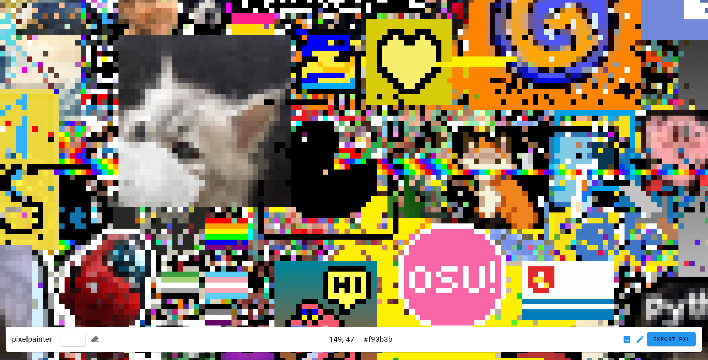

# pixelpainter
Pixelart creator for https://pixels.pythondiscord.com/ canvas. Features crappy code written in few hours, bugs, 
and custom file format which understands black as transparent so you can't paint in #000000.

